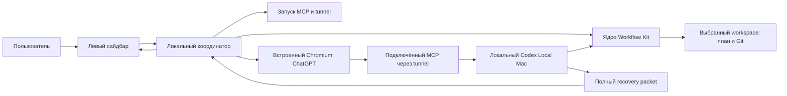

# Архитектура

## Состояние

Реализован локальный Project Web Pilot 0.6.0 для macOS arm64 на Electron 44.3.0 с WebContentsView. Приложение получает полный пакет через локальный MCP и отправляет его первым сообщением. Агент кратко подтверждает восстановление и описывает проект; машинный ACK не используется. Workspace хранит список сессий, доступный из дерева сайдбара. Встроенное ядро Workflow Kit создаёт и подключает папки с предварительной проверкой. Это прототип для пользовательского тестирования, с существующим внешним Codex Local Mac. Приёмка ожидается.

## Схема



ChatGPT использует свой веб-сервис для работы модели. На стороне приложения нет модельного API-клиента. Страница ChatGPT не получает прямой доступ к файловой системе через Electron: локальные действия агента идут через MCP.

## Компоненты

| Компонент | Ответственность |
| --- | --- |
| Сайдбар | Создание/подключение workspace, дерево чатов, текущая задача, состояние служб, отправки и контекста |
| Координатор | Привязки папка–чат, запуск сценария, сериализация отправки, таймауты, диагностика |
| Chromium | Реальная веб-страница, собственный сохраняемый профиль входа и обычное поле пользователя |
| Адаптер поля | Найти доступное поле, вставить сообщение и подтвердить его появление; обработать неопределённый исход |
| Workflow Kit | Установка структуры, канонический план, Git, управляемые коммиты и полный recovery packet |
| MCP runtime | Локальные файлы, команды и read-only recovery и полный пакет контекста |
| MCP lifecycle | Запустить существующие службы и проверить их готовность до сообщения агенту |

## Привязка workspace и чата

Хранить canonical absolute workspace, project_id, chat URL/ID после появления, непрозрачный session_id и текущую попытку отправки. До появления URL новый чат имеет локальный временный идентификатор. Привязка подтверждается при сохранении URL; её изменение не должно отправлять второй стартовый запрос.

Переключение сайдбара не меняет глобальный cwd MCP для уже работающего чата. Каждая локальная команда имеет явный workspace/working_directory. При переходе на другой чат координатор останавливает только своё ожидание и не передаёт контекст в чат другой папки. В первой версии одновременно автоматизируется одна отправка.

Это механизм согласованности контекста, а не изоляция полномочий: существующий MCP исполняет разрешённые пользователем локальные действия с его правами. Нельзя обещать ограничение всего MCP одной папкой только по состоянию сайдбара.

## Хранение и границы

Локальные настройки приложения, связи чатов и профиль Chromium находятся в каталоге данных приложения вне Git. Файлы проекта и план остаются в workspace. Секреты tunnel и существующие сервисные настройки остаются в защищённом каталоге Codex Local Mac; приложение получает статус, а не копирует секреты в сообщение или репозиторий.

Удалённый WebContentsView работает с nodeIntegration=false, contextIsolation=true и sandbox. Привилегированные операции доступны только локальному интерфейсу через узкий проверяемый IPC. Не публиковать универсальный запуск shell в страницу ChatGPT; проверять источник IPC, навигацию и открытие новых окон. Основание: [Electron security](https://www.electronjs.org/docs/latest/tutorial/security).

Авторизация ChatGPT выполняется пользователем штатным способом. Проверка встроенного входа обязательна: отдельные способы SSO ограничивают embedded user agents. Не обходить такие ограничения отключением защиты или копированием cookies из другого браузера.

## Переиспользование двух проектов

Первый прототип запускает существующий `Codex Local Mac/mac-codex-local/control.py` через явно настроенный абсолютный путь и использует установленный Workflow Kit выбранного проекта. Это даёт возможность проверить браузерный сценарий до массового переноса исходников.

После реальной проверки нужные исходные модули могут переноситься в новый проект с указанием upstream SHA, относительного пути, лицензии и локальных изменений. Начинать с ядра WF001 `kit/`, а не переписывать его правила в UI. SwiftUI и WinForms из WF001 служат справкой по пользовательским сценариям; новая оболочка не обязана механически переносить эти представления.

MCP и tunnel могут обслуживать другие чаты. Существующий процесс проверяется и используется; занятый чужой порт не освобождается принудительно. Закрытие окна прототипа не должно автоматически останавливать общую службу. Все аргументы процессов передаются массивами с корректной обработкой пробелов и Unicode.

Точная карта файлов: [SOURCE_WORKSPACES.md](../SOURCE_WORKSPACES.md). Канонический порядок запуска и доставки: [CONTEXT_DELIVERY.md](../CONTEXT_DELIVERY.md).

## Файлы реализации

Реализация находится в `src/main.mjs`, `src/workspace-session.mjs`, `src/mcp-runtime.mjs`, `src/chatgpt-composer.mjs`, `src/context-session.mjs`, `src/preload.cjs` и `src/ui/*`. Поведенческие и интеграционные проверки — в `tests/*`. Сайдбар использует обычные HTML/CSS/JavaScript без UI-фреймворка. Новые пути включаются через plan:apply до изменения.

## Ограничение исследования compact

Приложение контролирует своё открытие, выбор workspace, ввод и отправку сообщения. Оно пока не имеет подтверждённого сигнала внутреннего compact ChatGPT. Не превращать загрузку страницы, idle, reconnect, счётчик сообщений или задержку ответа в событие compact. Исследование возможного сигнала оформляется отдельно после первого прототипа.

## Профиль первого прототипа — T004

11.09.2026 пользователь поручил продолжить до запускаемого прототипа. Точные зависимости сверены с npm registry: Electron 44.3.0, @electron/packager 20.3.0. Язык — JavaScript ESM, без UI-фреймворка; локальный Node.js 22.17.0 и npm 10.9.2. Для DOM fixtures выбран jsdom 26.1.0, совместимый с установленным Node; он используется только в тестах и не входит в приложение.

Производственная оболочка использует встроенные Node modules и локальный MCP Streamable HTTP через fetch; модельных API-клиентов и runtime npm-зависимостей нет. Служебная упаковка в локальный .app выполняется @electron/packager; приложение открывается пользователем без терминала. Выход сборки — ignored .harness/runtime/build. Это локальный прототип без публикации, установщика или нотариализации. Browser profile хранится отдельно в каталоге данных Project Web Pilot.

Проверки назначаются по мере появления модулей: syntax — настоящий синтаксис entrypoint; workspace/runtime/composer/context — проверки поведения; suite — все созданные *.test.mjs; electron-smoke — окно, IPC и сценарий с явно обозначенным локальным fixture в настоящем Electron. Fixture не подтверждает вход, MCP доступ в аккаунте или реальный ACK.

Полная конфигурация, применяемая между T004 и T005:

```json
{
  "schema_version": 1,
  "profile": "DEVELOPMENT",
  "stack": "Electron 44.3.0 / Chromium, JavaScript ESM, Node.js 22.17.0; macOS arm64",
  "checks": [
    {
      "id": "syntax",
      "executable": "node",
      "args": [
        "--check",
        "src/main.mjs"
      ],
      "cwd": ".",
      "required": true,
      "timeout_ms": 30000,
      "stage": "commit"
    },
    {
      "id": "workspace",
      "executable": "node",
      "args": [
        "--test",
        "tests/workspace-session.test.mjs"
      ],
      "cwd": ".",
      "required": false,
      "timeout_ms": 60000,
      "stage": "commit"
    },
    {
      "id": "runtime",
      "executable": "node",
      "args": [
        "--test",
        "tests/mcp-runtime.test.mjs"
      ],
      "cwd": ".",
      "required": false,
      "timeout_ms": 60000,
      "stage": "commit"
    },
    {
      "id": "composer",
      "executable": "node",
      "args": [
        "--test",
        "tests/chatgpt-composer.test.mjs"
      ],
      "cwd": ".",
      "required": false,
      "timeout_ms": 60000,
      "stage": "commit"
    },
    {
      "id": "context",
      "executable": "node",
      "args": [
        "--test",
        "tests/context-session.test.mjs"
      ],
      "cwd": ".",
      "required": false,
      "timeout_ms": 60000,
      "stage": "commit"
    },
    {
      "id": "suite",
      "executable": "npm",
      "args": [
        "test"
      ],
      "cwd": ".",
      "required": false,
      "timeout_ms": 120000,
      "stage": "commit"
    },
    {
      "id": "electron-smoke",
      "executable": "npm",
      "args": [
        "run",
        "smoke"
      ],
      "cwd": ".",
      "required": false,
      "timeout_ms": 60000,
      "stage": "commit"
    }
  ],
  "budget": {
    "soft_tokens": 16000,
    "hard_tokens": 65536,
    "hard_bytes": 131072
  },
  "documentation": {
    "index": "docs/DOCUMENTATION_INDEX.md",
    "mappings": [
      {
        "code": "src/**",
        "documents": [
          "docs/architecture/ARCHITECTURE.md"
        ]
      },
      {
        "code": "tests/**",
        "documents": [
          "docs/VERIFICATION.md"
        ]
      },
      {
        "code": "package*.json",
        "documents": [
          "docs/architecture/ARCHITECTURE.md"
        ]
      },
      {
        "code": ".gitignore",
        "documents": [
          "docs/architecture/ARCHITECTURE.md"
        ]
      }
    ]
  }
}
```

Технические основания: [WebContentsView](https://www.electronjs.org/docs/latest/api/web-contents-view), [изоляция удалённой страницы](https://www.electronjs.org/docs/latest/tutorial/security), [Secure MCP Tunnel](https://developers.openai.com/api/docs/guides/secure-mcp-tunnels). Документация сверена 11.09.2026; совместимость реального входа подтверждается отдельным запуском.

required=true у syntax запускает общую проверку каркаса; остальные проверки обязательны в назначенных задачах через verification_ids. Так будущие тестовые файлы не запускаются до их создания. Любой ненулевой результат выбранной проверки блокирует commit.

## Каркас — T005

Создано одно BaseWindow с двумя WebContentsView. Локальная панель и удалённый браузер разделены; удалённому содержимому не доступны Node и IPC. Профиль persist:chatgpt находится в Library/Application Support/Project Web Pilot, обычный вход сохраняется отдельно от браузеров пользователя. HTTPS-переходы и окна авторизации допускаются с теми же изолированными настройками; непредусмотренные протоколы блокируются. Запуск через app.whenReady().then не удерживает ESM-загрузку ожиданием события ready.

package.json фиксирует зависимости и команды start/test/smoke/build. node_modules и выход упаковки исключены из Git. Проверка --shell-smoke использует отдельный временный профиль, открывает оба view и проверяет отсутствие require/process в удалённом контексте. Она не обращается к аккаунту ChatGPT.

## Workspace и сайдбар — T006

readWorkspace читает канонический JSON плана только для отображения идентичности и текущих фактов; статусы не изменяет. WorkspaceSessions хранит абсолютную realpath-папку, project_id, chat URL, session_id и попытку отдельно от репозитория. Запись атомарна и сериализована. Новый session_id создаётся только для нового чата; навигация на посторонний чат и подмена project_id отклоняются, позднее подтверждение старой сессии не применяется. UI подготовлен в src/ui/index.html; подключение его действий к главному процессу выполняется в T010.

После T005 полный diff lockfile обязательной зависимости превысил прежние 64 KiB. Диагностика status/repair подтвердила, что commit T005 завершён и транзакции нет. Между задачами config:apply увеличил ограниченный hard budget до 131072 байт / 65536 консервативно оценённых токенов. Plan:apply отключил включение произвольной последней задачи; прямые зависимости, актуальные инструкции и незавершённые изменения остаются полностью включены. Пакет COMPLETE; обязательный diff не обрезался.

## Локальные службы — T007

McpRuntime вызывает только status/start существующего control.py через абсолютный Python и массив аргументов; setup/configure/stop не поддерживаются. Параллельные запросы запуска объединяются. Уже готовые общие процессы используются без перезапуска; чужой PID, неготовый tunnel и отсутствие конфигурации дают отдельные ошибки. Секреты не читаются оболочкой.

LocalMcpClient использует Streamable HTTP на проверенном 127.0.0.1/mcp, выполняет initialize/initialized/tools-list, поддерживает JSON и SSE, проверяет имя сервера и четыре обязательных инструмента. Для tools/call разрешён только workflow_context_status. Recover/ACK/hook из оболочки отклоняются. Список инициализации и локальный статус не означают доступность плагина в веб-аккаунте. Протокол согласован с [MCP Streamable HTTP](https://modelcontextprotocol.io/specification/2025-03-26/basic/transports).

## Composer — T008

src/chatgpt-composer.mjs содержит один сериализованный адаптер обычного поля ввода. Его DOM-код не обращается к внутренним API страницы и не получает привилегированный IPC. Постоянный маркер отправки — opaque request_id в тексте пользовательского сообщения; факт отправки наблюдается в DOM. Жизненный цикл ожидания, durable attempt и status/ACK координируются отдельно в T009/T010. Полный контракт находится в CONTEXT_DELIVERY.

## Координатор контекста — T009

ContextSession отделяет выбор папки, готовность служб, ожидание поля, отправку, ожидание ACK и подтверждение. generation guard останавливает ещё не выполненные действия при переключении; durable attempt защищает от дублирования после перезапуска. Актуальная идентичность плана перечитывается из выбранного workspace, а история ACK поступает только через публичный status. Shell не вызывает recover/ack/hook. Подробная последовательность и критерии — в CONTEXT_DELIVERY.

## Собранный сценарий — T010

Главный процесс соединяет WorkspaceSessions, McpRuntime, ChatGPTComposer и ContextSession. Сайдбар получает ограниченный набор IPC-действий: выбор сохранённой или новой папки, новый чат, возврат, проверка статуса, обновление страницы и выбор существующего runtime. Проверяется отправитель, главный frame и точный локальный URL; удалённая страница не получает preload. Автоматическое ожидание выполняется последовательно каждые 1,5 секунды, переход между проектами отменяет предыдущий сценарий. Диагностика сохраняет только переходы состояния и идентификаторы, без challenge, содержимого сообщений или cookies.

Новый проект нельзя привязать к уже открытому постороннему чату: нужны собственная начатая попытка и наблюдаемое сообщение с request_id. При новом чате состояния старой отправки и ACK очищаются. Временный URL Work вида /c/WEB:UUID не сохраняется; после появления постоянного /c/UUID связь сохраняется штатно.

Локальная упаковка создаёт Project Web Pilot.app для macOS arm64. Упакованные исходники содержат только приложение, без документации проектов, тестов, Workflow runtime, ключей и пользовательского профиля. Тестовый режим доступен только неупакованному Electron и использует отдельный временный профиль с явно обозначенной страницей TEST FIXTURE.

## Повторный запуск и устаревание — T012

Повторный запуск упакованного приложения восстановил сохранённый вход, постоянный chat URL, session_id, request_id и ACK без нового Send. В координаторе исправлен случай, когда первый прочитанный ACK уже устарел относительно плана: он завершает прежнюю отправку и позволяет явное обновление. Ожидания и ошибки по-прежнему обрабатываются согласно CONTEXT_DELIVERY; нового lifecycle-сигнала compact нет.

## Прямая доставка — изменение T014–T017

Пользователь заменил стартовый запрос «получи контекст» полным пакетом в первом сообщении. Актуальная последовательность — CONTEXT_DELIVERY; прежние разделы T007–T012 описывают историю версии 0.1. LocalMcpClient теперь читает только workflow_context_recover, проверяет inline-context-v1, COMPLETE, workspace, восемь фактов, UTF-8 размер и SHA-256. Таймаут получения учитывает до 25 секунд работы штатного workflow recover. ContextSession получает пакет до ввода и сохраняет точное стартовое сообщение вместе с метаданными целостности. До click повторно проверяет текущий план и возраст пакета; переключение проекта отменяет неподтверждённую отправку. Наблюдаемый user message завершает доставку, отдельно ожидается постоянный URL чата. Повторное открытие сохраняет прежнюю доставку без нового recover или Send. Старые чаты не мигрируют автоматически; пользователь выбирает обновление либо новый чат. UI использует эти состояния с T016.

## Интерфейс прямой доставки — T016

Сайдбар отображает подготовку пакета, отправку, сохранение связи чата и «Контекст передан». В подробностях указаны размер, версия плана и время передачи. Отдельного ожидания ACK и связанных ошибок больше нет. Старые сохранённые сессии открываются без новой отправки; актуальный пакет запрашивается только кнопкой обновления либо в новом чате. Между процессами передаются только метаданные попытки, без полного сообщения. Диагностика фиксирует hash доставки вместо probe ID.

## История сессий workspace — T018

WorkspaceSessions schemaVersion=2 хранит sessions[] внутри каждого канонического workspace и selectedSessionId. Каждая сессия имеет собственные chatUrl, попытку передачи контекста, название, время создания и последнего открытия. newChat добавляет запись и выбирает её; selectSession восстанавливает конкретную запись. Координатор по-прежнему получает плоское представление текущей сессии, поэтому старый результат не применяется после переключения.

Загрузка schemaVersion=1 переносит единственную сохранённую связь в sessions[] и до атомарной записи создаёт исходную копию workspaces.json.v1-backup. Повторная миграция и перезапись копии не выполняются. Неоднозначные URL/ID, чужая сессия, изменившийся project_id и повреждённая структура отклоняются. Состояние раскрытия дерева хранится у workspace.

## Дерево и выбор сессий — T019

Сайдбар выводит вложенные списки workspace и сессий. Двойной клик по строке workspace или одиночный по стрелке меняет сохранённое expanded; это не переключает чат. Одиночный клик по workspace открывает выбранную в нём сессию. Нажатие на дочернюю строку передаёт явные workspace/sessionId через ограниченный IPC, проверяет принадлежность и открывает её URL. Сессии показаны в порядке создания с названием, порядковым номером и датой; активная выделена.

Название берётся из заголовка реально открытого ChatGPT только после совпадения его постоянного URL с выбранной сессией. Общие заголовки ChatGPT/New chat пропускаются. В renderer передаются только метаданные списка; текст контекста и прежние receipts туда не входят. При переключении координатор отменяет ещё не выполненные действия, затем использует сохранённую попытку выбранной сессии.

## Подготовка папок: ядро Workflow Kit

В `resources/workflow-kit/` включён точный исходный комплект WF001 1.1.0. Web Pilot использует существующие inspect/install/doctor и транзакционный Git-протокол, а не отдельную реализацию генерации планов. Происхождение и контрольные суммы — SOURCE_WORKSPACES. Бюджет recovery расширен до 524288 байт / 262144 консервативных токенов, чтобы обязательный diff атомарного импорта ядра помещался полностью; необязательные разделы не становятся обязательными, soft budget сохранён.

На этапе T021 включены исполняемые модули и схемы; шесть Markdown-шаблонов будут добавлены вместе с регистрацией в каталоге документов на T022. Проверка фиксирует исходные SHA всех файлов, проверяя присутствующую часть импорта. Причина разделения: предкоммитная проверка каталога потребовала регистрировать документы до их добавления; незавершённая транзакция допускает только повтор исходного состава задачи.

T022 завершает точный импорт 21 исходного файла и добавляет адаптер подготовки. `WorkspaceSetup` запускает отдельный процесс Node с ограниченным JSON-протоколом; `resources/workspace-setup-worker.mjs` использует неизменённое ядро inspect/install/doctor, добавляя проверку обязательных документов, целостности секций Git и COMPLETE recovery. Одноразовый preview token хранится в main. Перед записью повторно сверяются fingerprint и выбранный режим. Установка 1.0.0 поддержана для чтения без миграции; восстановление missing runtime/hooks допускается только для поставляемой 1.1.0. Подробный контракт — WORKSPACE_SETUP.

T023 связывает подготовку с фиксированными IPC main/preload и отдельным модулем формы сайдбара. Удалённый ChatGPT не получает preload, токены подготовки или возможность записывать через этот канал. При открытой подготовке доставка контекста приостановлена; ошибка/отмена не заменяют выбранную сессию. Начальная навигация после запуска, выбор workspace/сессии, создание чата и явное обновление контекста проверяют готовность папки до продолжения. Runtime обработчика находится вне asar в ресурсах локальной сборки.

Сборка 0.4.0 копирует `resources/` отдельно от asar в `Contents/Resources/resources`, чтобы настоящий Node мог читать обработчик и неизменённый комплект напрямую. Основное приложение и локальный UI остаются внутри asar. Тесты проверяют происхождение ядра, создание и сохранение существующей работы; реальная сборка проверена через системные диалоги и первые сообщения ChatGPT. Самостоятельная поставка Node/MCP для другого компьютера не заявляется.

## Архив workspace

T025 переводит WorkspaceSessions на schemaVersion 3 с archivedAt и резервной копией прежнего формата. Архив сохраняет историю, выбранную сессию и раскрытие; выбранный workspace при архивации очищается. Все изменения хранилища выполняются последовательно над копией и публикуются после успешной записи, чтобы сбой сохранения или параллельный заголовок чата не теряли данные. Контракт — PROJECT_ARCHIVE.

### Локальное удаление архива

`src/workspace-deletion.mjs` работает только с архивной записью WorkspaceSessions. Одноразовый preview связан с project_id, inode/device и отпечатком дерева. Подтверждённая операция журналируется в userData/deletions, переименовывает корень и удаляет только его; восстановление завершает очистку папки и локальных записей после сбоя. Пересечения с приложением, MCP и другими workspace запрещены. Ссылки на внешние файлы не обходятся; сетевых вызовов удаления нет.

### Архив в sidebar

`src/ui/project-archive.mjs` отображает архив, путь, возврат и подтверждение; preload экспортирует фиксированные команды, а main проверяет локальный sender. Snapshot разделяет активные проекты и архивные метаданные, не передаёт в архив тексты попыток. Settings и WorkspaceSetup взаимоисключаются; контроллер контекста приостановлен на время настроек. При старте приложение загружает schema 3 и завершает подтверждённые журналы удаления до открытия workspace.

### Поставка 0.5

Локальная macOS arm64-сборка включает 12 файлов src и прежние 22 resource-файла. Все включённые исходники сверены побайтно. Формат списка мигрирует из версии 2 в 3 с локальной резервной копией; реальная миграция сохранила пять workspace и шесть сессий. Авторизация Chromium сохраняется отдельно от архивных записей.

## Оформление оболочки — T029

Project Web Pilot хранит собственную тему оболочки (`light`/`dark`) в `~/Library/Application Support/Project Web Pilot/settings.json` рядом с путём Codex Local Mac. Запись выполняется тем же атомарным временным файлом, поэтому смена темы и смена runtime не перетирают друг друга. Текущее значение входит в локальный snapshot и доступно только sidebar через preload IPC; удалённый ChatGPT этот канал не получает.

Главный процесс применяет тему через Electron `nativeTheme.themeSource` и соответствующий `backgroundColor` BaseWindow. Это окрашивает нативную верхнюю панель macOS и служебную рамку приложения согласованно с локальным интерфейсом. Web Pilot не открывает и не меняет настройку темы внутри ChatGPT Web; пользовательский выбор ChatGPT остаётся отдельным.

### Переключатель темы в Settings — T030

`src/ui/project-archive.mjs` применяет `state.theme` к корневому `data-theme` и отправляет только `setTheme('light'|'dark')`. Палитра тёмного режима определена локальными CSS-переопределениями в sidebar: дерево проектов и сессий, карточки состояния, формы создания, Settings/архив, уведомления и кнопки не требуют перезагрузки. Удалённый WebContents не получает класс, CSS или IPC команды темы.

## Фильтр строк вызовов инструментов — T032

Web Pilot хранит локальный флаг `hideToolCalls` в `settings.json` и публикует его только в snapshot sidebar. Главный процесс после загрузки и внутристранничной навигации ChatGPT устанавливает небольшой DOM-наблюдатель только на `https://chatgpt.com/`: он ищет кликабельные элементы `button`, `[role=button]` и `summary` с локализованными подписями вызова инструмента (`Вызываемый инструмент`, `Called tool`, `Tool call`) и скрывает только эти элементы через локальный marker attribute. При отключении настройки marker снимается и исходные элементы немедленно возвращаются.

Фильтр не отменяет tool/MCP-вызовы, не меняет сообщения и не получает локальный IPC в удалённой странице. MutationObserver нужен только для новых строк, которые ChatGPT добавляет во время ответа; при повторной навигации старый observer отключается и устанавливается заново.

### Переключатель фильтра в Settings — T034

`src/ui/project-archive.mjs` отображает локальное состояние `hideToolCalls` двумя кнопками «Скрывать»/«Показывать» и отправляет только булеву команду через preload. Переключение применяется к уже открытому удалённому WebContents без навигации или перезагрузки. Настройка относится только к служебным строкам активности; содержимое сообщений, выполнение MCP/tools и изоляция ChatGPT не меняются.

## Разрешения встроенного ChatGPT — T035

Профиль `persist:chatgpt` больше не отклоняет все browser permissions безусловно. Главный процесс применяет единый allowlist только к точному HTTPS-origin `chatgpt.com`: `geolocation`/`geolocation-approximate` разрешены, а `media` разрешён лишь когда Electron сообщает исключительно `audio`. Любой запрос с `video`, смешанный audio+video, другой permission или другой origin отклоняется. Удалённая страница по-прежнему не получает preload или локальный IPC.

Одинаковая политика используется в `setPermissionRequestHandler` и `setPermissionCheckHandler`, поскольку Electron требует оба обработчика для полного permission flow. Это разрешает веб-диктовку и location API, но не открывает камеру, screen capture, notifications либо другие возможности Chromium.


### macOS privacy descriptions — T036

`resources/mac-permissions.plist` передаётся `electron-packager` через `--extend-info`, поэтому usage descriptions входят в основной `Info.plist` до завершения упаковки. Сборка содержит `NSMicrophoneUsageDescription`, `NSLocationWhenInUseUsageDescription` и совместимый `NSLocationUsageDescription`. Стандартный Electron template также содержит `NSCameraUsageDescription`, но это только текст системного privacy-ключа: фактический запрос камеры отклоняется allowlist-политикой T035.

## Массовое забывание архивов — scope 002 / T002

`WorkspaceSessions.forgetArchivedMany()` валидирует весь набор архивных `workspace/projectId` над копией store и только затем удаляет записи из `workspaces.json`. Файловая система workspace не участвует. `forgetArchived()` делегирует этому методу, поэтому физическое удаление после quarantine и новое действие «Убрать из списка» используют одну проверку локальной идентичности.

## Регулируемая ширина sidebar — scope 002 / T003

Главный процесс хранит `sidebarWidth` в локальном `settings.json` и единолично рассчитывает bounds двух `WebContentsView`. Историческая ширина 312 px — жёсткий минимум; справа сохраняется не менее 600 px для Chromium. Renderer может только запросить новую числовую ширину через ограниченный IPC, после чего main немедленно выполняет layout без навигации или перезагрузки ChatGPT.

### Drag splitter sidebar — scope 002 / T004

Локальный renderer рисует узкий `role=separator` у правого края sidebar. Pointer drag вычисляет новую ширину по `screenX`, а main остаётся единственным владельцем bounds и ограничений. Запросы во время drag ограничены `requestAnimationFrame`; клавиши ←/→ меняют ширину шагом 24 px. Минимум и текущее значение публикуются как ARIA metadata.

## Отдельное окно архива — scope 002 / T005

Архив реализован отдельным локальным `BrowserWindow` с `contextIsolation`, `sandbox` и специализированным `archive-preload.cjs`. Remote ChatGPT и обычный sidebar не получают archive-only команды массового forget/delete. Main хранит только transient deletion preview/notice; список проектов по-прежнему строится непосредственно из `WorkspaceSessions`.

### Archive renderer — scope 002 / T006

`src/ui/archive.mjs` хранит только transient Set выбранных workspace и anchor для Shift. Все проверки идентичности и файловые операции остаются в main/store. Обычный sidebar preload больше не экспортирует restore/delete archive IPC; он умеет только архивировать активный workspace и открыть локальное окно архива.

### Финальная интеграция scope 002 — T007

Интеграционная проверка не расширяет доверенную поверхность: resize остаётся sidebar→main IPC, а массовые archive-команды доступны только отдельному локальному archive preload. Settings открывает окно архива, но не получает restore/forget/delete методы обратно.


## Компактная карточка контекста — scope 002 / T008

Renderer всегда оставляет видимым динамический заголовок текущего состояния контекста. Остальные элементы карточки — пояснение, три строки состояния и кнопки действий — находятся в `context-details` и по умолчанию свёрнуты. Локальная кнопка-треугольник управляет только видимостью renderer и не меняет ContextSession или доставку пакета. Тот же disclosure-паттерн используется для списка сессий проекта; его треугольник увеличен до хорошо различимого размера без изменения логики `setExpanded`.

## Компактный блок выбранного проекта — scope 002 / T009

`workspace-details` больше не дублирует имя, абсолютный путь и результат проверки Workflow Kit. Эти сведения продолжают существовать в локальном состоянии и используются логикой открытия workspace, но визуально под деревом сессий остаётся только существующий `plan-text`. Представление и семантика самого плана на этом этапе не меняются.

## Копирование пути workspace — scope 002 / T010

Пункт «Скопировать полный путь» живёт в локальном меню ⋯ активного проекта. Renderer передаёт только workspace через preload IPC; main повторно проверяет, что это зарегистрированный неархивный проект, и записывает его канонический путь через Electron `clipboard.writeText`. Удалённый WebContents ChatGPT этого IPC не получает.

### Завершённое копирование пути — scope 002 / T011

В Electron 44 `clipboard.writeText()` асинхронен. Main теперь `await`-ит запись перед завершением IPC, поэтому пункт меню не сообщает успех раньше фактического обновления системного clipboard. Это исключает гонку между пользовательским кликом и последующим использованием вставки.

## Пользовательская модель плана — scope 003 / T002

`readWorkspace()` по-прежнему читает канонический JSON из `.harness/plans/todo-plan.md`, но дополнительно формирует отдельный `planView` для локального UI. В него входят только lifecycle (`working`, `awaiting-acceptance`, `blocked`, `closed`, `not-created`), счётчики и массив `{id,title,status}` со статусами `done/current/pending`. Технический `planRevision` остаётся отдельным внутренним полем для проверки свежести context packet и не входит в `planView`.

## Карточка «План» — scope 003 / T003

Sidebar рендерит `selected.planView` как самостоятельную карточку и не читает `.harness/plans/todo-plan.md` напрямую. `done/current/pending` отображаются как `✓/●/○`; текущая строка выделяется фоном. Lifecycle переводится в пользовательские формулировки: работа с прогрессом, ожидание приёмки, блокировка, закрытый scope или отсутствие созданного плана. `planRevision` остаётся только во внутренних объектах контекстного протокола и не выводится в карточке.
## Поставка 0.6.0 — scope 003 / T004

Версия приложения и `electron-packager --app-version` синхронизированы на 0.6.0. Пользовательский sidebar показывает `planView`, а внутренний `planRevision` продолжает использоваться только для проверки свежести контекстного пакета. Релиз сохраняет прежнюю локальную архитектуру Electron/WebContentsView, отдельный Chromium-профиль и существующие границы IPC.


## Команда приёмки плана — scope 003 / T005

`ChatGPTComposer.sendUserMessage()` использует тот же видимый composer, что и стартовая доставка, но не требует request-id в тексте. Перед fill проверяются login, пустой draft и отсутствие активной генерации; после click успех подтверждается увеличением числа DOM-сообщений пользователя. Метод не выполняет автоматический retry после неопределённого click, поэтому не может скрыто продублировать пользовательскую команду.

## Кнопка приёмки плана — scope 003 / T006

Кнопка `Принять` доступна только локальному sidebar. Main повторно читает канонический plan через `WorkspaceSessions.inspect`, требует `planView.state=awaiting-acceptance` и совпадение выбранной сессии с открытым ChatGPT URL. После этого используется `controller.composer.sendUserMessage`; удалённая страница не получает новый IPC. Текст является явной пользовательской командой штатно архивировать текущий scope и оставить Workflow Kit в `NONE`, не создавая следующий scope автоматически. Неопределённый результат click блокирует повторную отправку до смены lifecycle.

## Renderer кнопки приёмки — scope 003 / T008

`src/ui/sidebar.mjs` активирует `#accept-plan` только для `planView.state=awaiting-acceptance` и при отсутствии transient `planAcceptance`. После IPC-состояний `sending/sent/unknown` меняется подпись кнопки и повторный click блокируется. Это чистое отображение main-policy: renderer не может сам архивировать scope или обойти повторную проверку канонического плана.


## Closed-state карточки плана — scope 004 / T001

Renderer использует уже существующий `planView.state=closed`, который `readWorkspace()` формирует для `NONE` с непустым `archived_scope_id`. В этом состоянии карточка показывает основной статус «Scope завершён и архивирован» и нейтральную вторую строку «Проект готов к следующему новому плану.». Кнопка приёмки остаётся disabled; отдельного IPC или нового lifecycle-состояния не добавляется.

## Scope-bound приёмка — scope 004 / T002

Transient `planAcceptance` теперь хранит `scopeId` вместе с workspace. Sidebar получает `sending/sent/unknown` только когда совпадают и workspace, и текущий `scopeId`; поэтому подтверждение предыдущего scope не может заблокировать кнопку «Принять» в следующем scope того же проекта. Main использует тот же `scopeId` для дедупликации повторного клика.

## Безопасный Chromium diagnostics — scope 005 / T001

`src/chromium-diagnostics.mjs` содержит независимый от UI диагностический слой. `DiagnosticJsonl` сериализует JSONL-запись и ротирует основной файл при достижении лимита, сохраняя одну предыдущую копию. `safeUrl()` удаляет fragment и значения query-параметров и маскирует длинные/UUID path-segments. `payloadMetadata()` никогда не сохраняет исходный WebSocket/SSE payload: только byte length, SHA-256, top-level JSON keys и ограниченный набор безопасных identifier-полей. `ChromiumDiagnostics` умеет принимать native WebContents/CDP события и безопасные DOM pulses; подключение к production WebContents выполняется отдельной задачей T002.

## Подключение Chromium diagnostics — scope 005 / T002

Главный ChatGPT `WebContents` получает один `ChromiumDiagnostics`. Чтобы не вмешиваться в создание renderer, CDP подключается только после первого `did-finish-load`, а не к исходному `about:blank`. Затем включаются `Network`, `Page`, `Log` и lifecycle events. Native WebContents события, request/response metadata, WebSocket/EventSource metadata и периодический DOM pulse пишутся в `userData/diagnostics/chromium-events.jsonl`. Production DOM pulse выполняется раз в 5 секунд и содержит только redacted URL, количество user/assistant сообщений, признаки busy/composer и `document.visibilityState`. Файл ограничен 25 MiB и ротируется в одну предыдущую копию. Диагностика best-effort: ошибка attach не должна ломать ChatGPT.

## Context telemetry parser — scope 006 / T001

`src/chromium-diagnostics.mjs` теперь отдельно извлекает безопасную телеметрию из JSON/SSE/WebSocket payload. Парсер использует allowlist числовых полей `input_tokens`, `cached_input_tokens`, `cache_write_input_tokens`, `output_tokens`, `reasoning_output_tokens`, `total_tokens`, `model_context_window` и совместимых context/window variants; известные структуры `last_token_usage`/`total_token_usage` сохраняются как числовые объекты. Прямые markers ограничены известными служебными значениями `token_count`, `compacted`, `ContextCompaction` и близкими именами. Значения `compaction_response_id`/`window_id` не записываются: сохраняется только факт наличия ключа. Текст `message`, `content`, `replacement_history`, summary и произвольные строки не попадают в telemetry.

## ChatGPT stream telemetry — scope 006 / T002

`ChromiumDiagnostics` отслеживает response metadata только для точного `https://chatgpt.com/backend-api/f/conversation` с MIME `text/event-stream`. После `Network.loadingFinished` CDP `Network.getResponseBody` читает завершённый stream в память; raw body не сериализуется. Записываются byte count, SHA-256, факт наличия telemetry и отдельная `telemetry/context` запись. WebSocket/EventSource payload проходят тот же parser немедленно. `telemetry/context` нормализует `inputTokens`, `modelContextWindow`, `usedPercent`; прямые markers `compacted`/`ContextCompaction` дают `compactSignal=direct`, а после заполнения не менее 75% резкий сброс input до 0 или менее половины предыдущего значения отмечается как `token-reset`/`token-drop`. Это диагностический signal, а не автоматическое действие.

## Candidate discovery Web stream — scope 007 / T001

Реальный ChatGPT Web после запуска scope 006 дал `conversation-stream-inspected.telemetryFound=false` для `/backend-api/f/conversation`, а WebSocket передаёт `conversation-turn-stream/stream-item` без знакомого Codex `token_count`. Поэтому parser дополнительно ищет структурные имена ключей с `token/context/usage/window/compact`. Для неизвестных схем сохраняются только безопасный key path и конечное неотрицательное число; строковые значения не сохраняются. Поддеревья `content`, `parts`, `text`, `replacement_history`, `guardian_history` вообще не обходятся candidate-discovery, чтобы пользовательский текст и tool content не могли стать диагностической telemetry. Число candidate paths на payload ограничено; точный allowlist scope 006 продолжает работать без изменений.

## Последнее observation context window — scope 007 / T002

`ChromiumDiagnostics.contextObservation()` возвращает только локальный безопасный state. `known` создаётся исключительно когда в фактической telemetry одновременно найдены положительные `inputTokens` и `modelContextWindow`; тогда сохраняются также `usedPercent`, origin, время наблюдения и compact signal. Candidate keys сами по себе не превращаются в known-state. При прямом compact без новой пары usage/window состояние становится `unknown`; при main-frame navigation также очищаются предыдущий usage и observation, поэтому значение одного чата не переносится в другой. Main добавляет этот state в обычный sidebar snapshot и публикует изменение через существующий локальный канал; удалённый ChatGPT не получает IPC.

## Sidebar context-window indicator — scope 007 / T003

Локальный renderer получает только `state.contextWindow` из main snapshot. При `status=known` карточка «Контекстное окно» показывает компактные значения `inputTokens / modelContextWindow`, подтверждённый `usedPercent` и progressbar с тем же значением. При `unknown` выводится только «Ожидаем данные», а progressbar скрыт; renderer не читает JSONL и не имеет доступа к CDP/WebSocket/SSE payload. Навигационный reset из T002 тем самым немедленно убирает устаревший процент из UI.


## Вложенные JSON-envelope Web stream — scope 008 / T001

Production-наблюдение scope 007 подтвердило, что обычный `/backend-api/f/conversation` после запуска новой сборки содержит только безопасный candidate `token` без числового context usage. Для WebSocket `conversation-turn-stream/stream-item` parser теперь ограниченно раскрывает JSON-object/array, сериализованный внутри строкового transport-envelope, и повторно применяет тот же числовой telemetry allowlist/candidate discovery. Разбор ограничен 256 KiB на строку, максимум 12 вложенными JSON-string и общим traversal budget. Ветви `message`, `content`, `parts`, `text`, `tool_output`, `output_text`, `input_text`, `replacement_history` и `guardian_history` никогда не раскрываются как nested JSON, поэтому пользовательский JSON и текст tool output не могут сформировать ложную context telemetry.

## Безопасные server-side context signals — scope 008 / T002

Raw-эксперимент подтвердил транспорт `conversation-turn-stream → stream-item → encoded_item`, где `encoded_item` является вложенным SSE (`event: delta`, `data: {...}`), а не бинарным blob. Безопасный parser теперь умеет повторно разбирать `data:` внутри такого envelope, продолжая исключать message/content/tool-output поддеревья. Отдельно `ChromiumDiagnostics` читает в памяти JSON-body только двух служебных ответов: `/backend-api/models` и `/backend-api/conversations/<id>`. Из models сохраняются только безопасные `modelSlug=gpt-5-6-thinking` и `maxTokens`; из conversation — только `continuationPresent`, `continuationType`, `summaryMetadataPresent` и `hasPreviousPage`. Фактическое значение `context_truncation_continuation` никогда не журналируется. Найденный live limit для GPT-5.6 Sol Thinking — 262144.

## Platform boundary локального runtime — scope 008 / T004

`src/platform.mjs` становится единственным местом, где код приложения знает filesystem layout локального Codex runtime. Для `darwin` сохраняется текущий источник `mac-codex-local` и `.venv/bin/python3`; для `win32` описан layout `.venv/Scripts/python.exe` и нейтральные варианты корня `windows-codex-local`/`codex-local`. `McpRuntime` получает `platform` как зависимость и использует только результат adapter, поэтому бизнес-логика запуска `status/start`, проверка ownership и MCP protocol не зависят от ОС. Это подготовка границы платформы, а не утверждение готовности Windows runtime.
