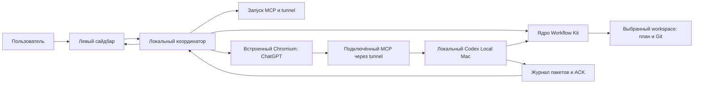

# Архитектура

## Состояние

Это проект реализации, а не описание готового Project Web Pilot. Исходный workspace содержит Workflow Kit 1.1.0 и документы. Исполняемые компоненты нового приложения пока отсутствуют. Для реализации выбран Electron 44.3.0 с WebContentsView; профиль и проверки определены в T004.

## Схема



ChatGPT использует свой веб-сервис для работы модели. На стороне приложения нет модельного API-клиента. Страница ChatGPT не получает прямой доступ к файловой системе через Electron: локальные действия агента идут через MCP.

## Компоненты

| Компонент | Ответственность |
| --- | --- |
| Сайдбар | Выбор workspace, связанный чат, состояние служб, отправки и контекста; позже создание/подключение и план |
| Координатор | Привязки папка–чат, запуск сценария, сериализация отправки, таймауты, диагностика |
| Chromium | Реальная веб-страница, собственный сохраняемый профиль входа и обычное поле пользователя |
| Адаптер поля | Найти доступное поле, вставить сообщение и подтвердить его появление; обработать неопределённый исход |
| Workflow Kit | Установка структуры, канонический план, Git, управляемые коммиты и полный recovery packet |
| MCP runtime | Локальные файлы, команды и существующий протокол context recovery/ACK/status |
| MCP lifecycle | Запустить существующие службы и проверить их готовность до сообщения агенту |

## Привязка workspace и чата

Хранить canonical absolute workspace, project_id, chat URL/ID после появления, непрозрачный session_id и текущую попытку отправки. До появления URL новый чат имеет локальный временный идентификатор. Привязка подтверждается при сохранении URL; её изменение не должно отправлять второй стартовый запрос.

Переключение сайдбара не меняет глобальный cwd MCP для уже работающего чата. Каждая локальная команда имеет явный workspace/working_directory. При переходе на другой чат координатор останавливает только своё ожидание и не подменяет полученный ACK данными другой папки. В первой версии одновременно автоматизируется одна отправка.

Это механизм согласованности контекста, а не изоляция полномочий: существующий MCP исполняет разрешённые пользователем локальные действия с его правами. Нельзя обещать ограничение всего MCP одной папкой только по состоянию сайдбара.

## Хранение и границы

Локальные настройки приложения, связи чатов и профиль Chromium находятся в каталоге данных приложения вне Git. Файлы проекта и план остаются в workspace. Секреты tunnel и существующие сервисные настройки остаются в защищённом каталоге Codex Local Mac; приложение получает статус, а не копирует секреты в сообщение или репозиторий.

Удалённый WebContentsView работает с nodeIntegration=false, contextIsolation=true и sandbox. Привилегированные операции доступны только локальному интерфейсу через узкий проверяемый IPC. Не публиковать универсальный запуск shell в страницу ChatGPT; проверять источник IPC, навигацию и открытие новых окон. Основание: [Electron security](https://www.electronjs.org/docs/latest/tutorial/security).

Авторизация ChatGPT выполняется пользователем штатным способом. Проверка встроенного входа обязательна: отдельные способы SSO ограничивают embedded user agents. Не обходить такие ограничения отключением защиты или копированием cookies из другого браузера.

## Переиспользование двух проектов

Первый прототип запускает существующий `Codex Local Mac/mac-codex-local/control.py` через явно настроенный абсолютный путь и использует установленный Workflow Kit выбранного проекта. Это даёт возможность проверить браузерный сценарий до массового переноса исходников.

После реальной проверки нужные исходные модули могут переноситься в новый проект с указанием upstream SHA, относительного пути, лицензии и локальных изменений. Начинать с ядра WF001 `kit/`, а не переписывать его правила в UI. SwiftUI и WinForms из WF001 служат справкой по пользовательским сценариям; новая оболочка не обязана механически переносить эти представления.

MCP и tunnel могут обслуживать другие чаты. Существующий процесс проверяется и используется; занятый чужой порт не освобождается принудительно. Закрытие окна прототипа не должно автоматически останавливать общую службу. Все аргументы процессов передаются массивами с корректной обработкой пробелов и Unicode.

Точная карта файлов: [SOURCE_WORKSPACES.md](../SOURCE_WORKSPACES.md). Канонический порядок запуска и доставки: [CONTEXT_DELIVERY.md](../CONTEXT_DELIVERY.md).

## Плановые файлы

Имена `src/main.mjs`, `workspace-session.mjs`, `mcp-runtime.mjs`, `chatgpt-composer.mjs`, `context-session.mjs`, `src/ui/*` и `tests/*` в TODO задают первоначальное разделение задач. Это ещё не существующие файлы. Уточнение технических путей делается через plan:apply до их изменения. Дополнительный UI-фреймворк для простого проверочного сайдбара заранее не требуется.

## Ограничение исследования compact

Приложение контролирует своё открытие, выбор workspace, ввод и отправку сообщения. Оно пока не имеет подтверждённого сигнала внутреннего compact ChatGPT. Не превращать загрузку страницы, idle, reconnect, счётчик сообщений или задержку ответа в событие compact. Исследование возможного сигнала оформляется отдельно после первого прототипа.

## Профиль первого прототипа — T004

11.09.2026 пользователь поручил продолжить до запускаемого прототипа. Точные зависимости сверены с npm registry: Electron 44.3.0, @electron/packager 20.3.0. Язык — JavaScript ESM, без UI-фреймворка; локальный Node.js 22.17.0 и npm 10.9.2. Для DOM fixtures выбран jsdom 26.1.0, совместимый с установленным Node; он используется только в тестах и не входит в приложение.

Производственная оболочка использует встроенные Node modules и локальный MCP Streamable HTTP через fetch; модельных API-клиентов и runtime npm-зависимостей нет. Служебная упаковка в локальный .app выполняется @electron/packager; приложение открывается пользователем без терминала. Выход сборки — ignored .harness/runtime/build. Это локальный прототип без публикации, установщика или нотариализации. Browser profile хранится отдельно в каталоге данных Project Web Pilot.

Проверки назначаются по мере появления модулей: syntax — настоящий синтаксис entrypoint; workspace/runtime/composer/context — проверки поведения; suite — все созданные *.test.mjs; electron-smoke — окно, IPC и сценарий с явно обозначенным локальным fixture в настоящем Electron. Fixture не подтверждает вход, MCP доступ в аккаунте или реальный ACK.

Полная конфигурация, применяемая между T004 и T005:

```json
{
  "schema_version": 1,
  "profile": "DEVELOPMENT",
  "stack": "Electron 44.3.0 / Chromium, JavaScript ESM, Node.js 22.17.0; macOS arm64",
  "checks": [
    {
      "id": "syntax",
      "executable": "node",
      "args": [
        "--check",
        "src/main.mjs"
      ],
      "cwd": ".",
      "required": true,
      "timeout_ms": 30000,
      "stage": "commit"
    },
    {
      "id": "workspace",
      "executable": "node",
      "args": [
        "--test",
        "tests/workspace-session.test.mjs"
      ],
      "cwd": ".",
      "required": false,
      "timeout_ms": 60000,
      "stage": "commit"
    },
    {
      "id": "runtime",
      "executable": "node",
      "args": [
        "--test",
        "tests/mcp-runtime.test.mjs"
      ],
      "cwd": ".",
      "required": false,
      "timeout_ms": 60000,
      "stage": "commit"
    },
    {
      "id": "composer",
      "executable": "node",
      "args": [
        "--test",
        "tests/chatgpt-composer.test.mjs"
      ],
      "cwd": ".",
      "required": false,
      "timeout_ms": 60000,
      "stage": "commit"
    },
    {
      "id": "context",
      "executable": "node",
      "args": [
        "--test",
        "tests/context-session.test.mjs"
      ],
      "cwd": ".",
      "required": false,
      "timeout_ms": 60000,
      "stage": "commit"
    },
    {
      "id": "suite",
      "executable": "npm",
      "args": [
        "test"
      ],
      "cwd": ".",
      "required": false,
      "timeout_ms": 120000,
      "stage": "commit"
    },
    {
      "id": "electron-smoke",
      "executable": "npm",
      "args": [
        "run",
        "smoke"
      ],
      "cwd": ".",
      "required": false,
      "timeout_ms": 60000,
      "stage": "commit"
    }
  ],
  "budget": {
    "soft_tokens": 16000,
    "hard_tokens": 65536,
    "hard_bytes": 131072
  },
  "documentation": {
    "index": "docs/DOCUMENTATION_INDEX.md",
    "mappings": [
      {
        "code": "src/**",
        "documents": [
          "docs/architecture/ARCHITECTURE.md"
        ]
      },
      {
        "code": "tests/**",
        "documents": [
          "docs/VERIFICATION.md"
        ]
      },
      {
        "code": "package*.json",
        "documents": [
          "docs/architecture/ARCHITECTURE.md"
        ]
      },
      {
        "code": ".gitignore",
        "documents": [
          "docs/architecture/ARCHITECTURE.md"
        ]
      }
    ]
  }
}
```

Технические основания: [WebContentsView](https://www.electronjs.org/docs/latest/api/web-contents-view), [изоляция удалённой страницы](https://www.electronjs.org/docs/latest/tutorial/security), [Secure MCP Tunnel](https://developers.openai.com/api/docs/guides/secure-mcp-tunnels). Документация сверена 11.09.2026; совместимость реального входа подтверждается отдельным запуском.

required=true у syntax запускает общую проверку каркаса; остальные проверки обязательны в назначенных задачах через verification_ids. Так будущие тестовые файлы не запускаются до их создания. Любой ненулевой результат выбранной проверки блокирует commit.

## Каркас — T005

Создано одно BaseWindow с двумя WebContentsView. Локальная панель и удалённый браузер разделены; удалённому содержимому не доступны Node и IPC. Профиль persist:chatgpt находится в Library/Application Support/Project Web Pilot, обычный вход сохраняется отдельно от браузеров пользователя. HTTPS-переходы и окна авторизации допускаются с теми же изолированными настройками; непредусмотренные протоколы блокируются. Запуск через app.whenReady().then не удерживает ESM-загрузку ожиданием события ready.

package.json фиксирует зависимости и команды start/test/smoke/build. node_modules и выход упаковки исключены из Git. Проверка --shell-smoke использует отдельный временный профиль, открывает оба view и проверяет отсутствие require/process в удалённом контексте. Она не обращается к аккаунту ChatGPT.

## Workspace и сайдбар — T006

readWorkspace читает канонический JSON плана только для отображения идентичности и текущих фактов; статусы не изменяет. WorkspaceSessions хранит абсолютную realpath-папку, project_id, chat URL, session_id и попытку отдельно от репозитория. Запись атомарна и сериализована. Новый session_id создаётся только для нового чата; навигация на посторонний чат и подмена project_id отклоняются, позднее подтверждение старой сессии не применяется. UI подготовлен в src/ui/index.html; подключение его действий к главному процессу выполняется в T010.

После T005 полный diff lockfile обязательной зависимости превысил прежние 64 KiB. Диагностика status/repair подтвердила, что commit T005 завершён и транзакции нет. Между задачами config:apply увеличил ограниченный hard budget до 131072 байт / 65536 консервативно оценённых токенов. Plan:apply отключил включение произвольной последней задачи; прямые зависимости, актуальные инструкции и незавершённые изменения остаются полностью включены. Пакет COMPLETE; обязательный diff не обрезался.
