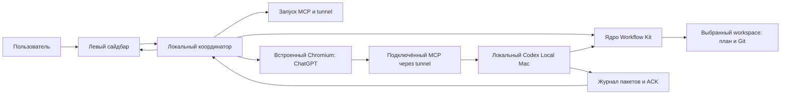

# Архитектура

## Состояние

Это проект реализации, а не описание готового Project Web Pilot. Исходный workspace содержит Workflow Kit 1.1.0 и документы. Исполняемые компоненты нового приложения пока отсутствуют. Electron/WebContentsView — предлагаемый минимальный путь; конкретные версии и проверки определяются в T004.

## Схема

ChatGPT использует свой веб-сервис для работы модели. На стороне приложения нет модельного API-клиента. Страница ChatGPT не получает прямой доступ к файловой системе через Electron: локальные действия агента идут через MCP.

## Компоненты

| Компонент | Ответственность |
| --- | --- |
| Сайдбар | Выбор workspace, связанный чат, состояние служб, отправки и контекста; позже создание/подключение и план |
| Координатор | Привязки папка–чат, запуск сценария, сериализация отправки, таймауты, диагностика |
| Chromium | Реальная веб-страница, собственный сохраняемый профиль входа и обычное поле пользователя |
| Адаптер поля | Найти доступное поле, вставить сообщение и подтвердить его появление; обработать неопределённый исход |
| Workflow Kit | Установка структуры, канонический план, Git, управляемые коммиты и полный recovery packet |
| MCP runtime | Локальные файлы, команды и существующий протокол context recovery/ACK/status |
| MCP lifecycle | Запустить существующие службы и проверить их готовность до сообщения агенту |

## Привязка workspace и чата

Хранить canonical absolute workspace, project_id, chat URL/ID после появления, непрозрачный session_id и текущую попытку отправки. До появления URL новый чат имеет локальный временный идентификатор. Привязка подтверждается при сохранении URL; её изменение не должно отправлять второй стартовый запрос.

Переключение сайдбара не меняет глобальный cwd MCP для уже работающего чата. Каждая локальная команда имеет явный workspace/working_directory. При переходе на другой чат координатор останавливает только своё ожидание и не подменяет полученный ACK данными другой папки. В первой версии одновременно автоматизируется одна отправка.

Это механизм согласованности контекста, а не изоляция полномочий: существующий MCP исполняет разрешённые пользователем локальные действия с его правами. Нельзя обещать ограничение всего MCP одной папкой только по состоянию сайдбара.

## Хранение и границы

Локальные настройки приложения, связи чатов и профиль Chromium находятся в каталоге данных приложения вне Git. Файлы проекта и план остаются в workspace. Секреты tunnel и существующие сервисные настройки остаются в защищённом каталоге Codex Local Mac; приложение получает статус, а не копирует секреты в сообщение или репозиторий.

Удалённый WebContentsView работает с nodeIntegration=false, contextIsolation=true и sandbox. Привилегированные операции доступны только локальному интерфейсу через узкий проверяемый IPC. Не публиковать универсальный запуск shell в страницу ChatGPT; проверять источник IPC, навигацию и открытие новых окон. Основание: [Electron security](https://www.electronjs.org/docs/latest/tutorial/security).

Авторизация ChatGPT выполняется пользователем штатным способом. Проверка встроенного входа обязательна: отдельные способы SSO ограничивают embedded user agents. Не обходить такие ограничения отключением защиты или копированием cookies из другого браузера.

## Переиспользование двух проектов

Первый прототип запускает существующий `Codex Local Mac/mac-codex-local/control.py` через явно настроенный абсолютный путь и использует установленный Workflow Kit выбранного проекта. Это даёт возможность проверить браузерный сценарий до массового переноса исходников.

После реальной проверки нужные исходные модули могут переноситься в новый проект с указанием upstream SHA, относительного пути, лицензии и локальных изменений. Начинать с ядра WF001 `kit/`, а не переписывать его правила в UI. SwiftUI и WinForms из WF001 служат справкой по пользовательским сценариям; новая оболочка не обязана механически переносить эти представления.

MCP и tunnel могут обслуживать другие чаты. Существующий процесс проверяется и используется; занятый чужой порт не освобождается принудительно. Закрытие окна прототипа не должно автоматически останавливать общую службу. Все аргументы процессов передаются массивами с корректной обработкой пробелов и Unicode.

Точная карта файлов: [SOURCE_WORKSPACES.md](../SOURCE_WORKSPACES.md). Канонический порядок запуска и доставки: [CONTEXT_DELIVERY.md](../CONTEXT_DELIVERY.md).

## Плановые файлы

Имена `src/main.mjs`, `workspace-session.mjs`, `mcp-runtime.mjs`, `chatgpt-composer.mjs`, `context-session.mjs`, `src/ui/*` и `tests/*` в TODO задают первоначальное разделение задач. Это ещё не существующие файлы. Уточнение технических путей делается через plan:apply до их изменения. Дополнительный UI-фреймворк для простого проверочного сайдбара заранее не требуется.

## Ограничение исследования compact

Приложение контролирует своё открытие, выбор workspace, ввод и отправку сообщения. Оно пока не имеет подтверждённого сигнала внутреннего compact ChatGPT. Не превращать загрузку страницы, idle, reconnect, счётчик сообщений или задержку ответа в событие compact. Исследование возможного сигнала оформляется отдельно после первого прототипа.
